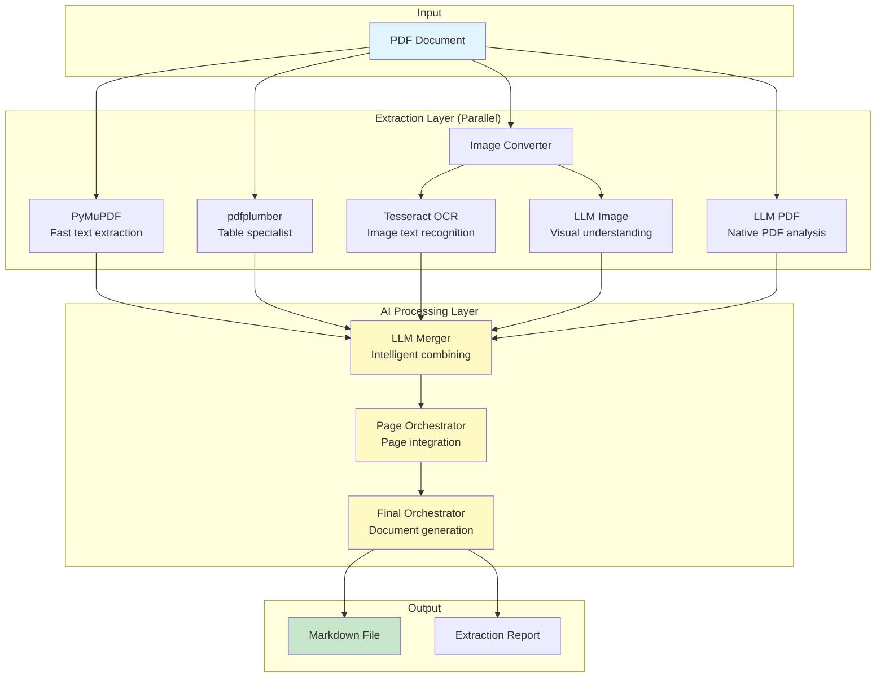

# pdf2md

[](https://opensource.org/licenses/MIT)
[](https://www.python.org/downloads/)
[](https://github.com/psf/black)

A high-quality PDF to Markdown converter that uses multiple extraction engines and AI-powered merging to produce superior results, especially for complex layouts, tables, and mixed-language documents.

## ✨ Key Features

- **🚀 Multi-Engine Extraction**: Runs 5 different extraction methods in parallel for comprehensive text capture
- **🤖 AI-Powered Merging**: Uses LLMs (Claude/OpenAI) to intelligently merge and correct extraction results
- **📄 Page-by-Page Processing**: Prevents context mixing and ensures accurate document structure preservation
- **🌏 Multilingual Support**: Excellent support for mixed-language documents (English, Korean, Chinese, Japanese, etc.)
- **📊 Superior Table Extraction**: Combines multiple engines for accurate table structure preservation
- **⚡ Parallel Processing**: Efficient batch processing with configurable concurrency
- **🎯 AI-Powered Selection**: LLM intelligently combines all extraction results for optimal accuracy

## 🚀 Quick Start

### Prerequisites

- Python 3.11+
- Tesseract OCR (optional, for OCR functionality)
- API key for Claude (Anthropic) or OpenAI

### Installation

```bash
# Clone the repository
git clone https://github.com/yourusername/pdf2md.git
cd pdf2md

# Install dependencies
pip install -r requirements.txt

# Set up API keys
echo "ANTHROPIC_API_KEY=your_claude_api_key" > .env
# or
echo "OPENAI_API_KEY=your_openai_api_key" > .env
```

### Basic Usage

```bash
# Convert a PDF to Markdown
python main.py --in document.pdf

# Specify output path
python main.py --in document.pdf --out output.md

# Use specific LLM provider
python main.py --in document.pdf --llm claude
```

## 🏗️ Architecture

### System Overview



### Extraction Engines

| Engine | Strengths | Best For |
|--------|-----------|----------|
| **PyMuPDF** | Fast, reliable text extraction | Standard PDFs with selectable text |
| **pdfplumber** | Excellent table detection | Documents with complex tables |
| **Tesseract OCR** | Optical character recognition | Scanned documents, images |
| **LLM PDF** | Context understanding | Complex layouts, mixed content |
| **LLM Image** | Visual comprehension | Charts, diagrams, handwriting |

### Processing Pipeline

1. **Page Splitting**: PDF is split into individual pages for independent processing
2. **Parallel Extraction**: All 5 engines process each page simultaneously
3. **AI Merging**: LLM intelligently combines and corrects results from all extractors
4. **Page Integration**: Individual page results are integrated without formatting
5. **Final Generation**: Complete markdown document with proper formatting

## 📦 Installation

### System Requirements

- **Python**: 3.11 or higher
- **Memory**: 4GB RAM minimum (8GB recommended for large PDFs)
- **Storage**: 1GB free space for dependencies

### Detailed Setup

#### macOS

```bash
# Install Tesseract OCR (optional but recommended)
brew install tesseract tesseract-lang

# Clone and setup
git clone https://github.com/yourusername/pdf2md.git
cd pdf2md
pip install -r requirements.txt
```

#### Ubuntu/Debian

```bash
# Install Tesseract OCR (optional but recommended)
sudo apt-get update
sudo apt-get install tesseract-ocr tesseract-ocr-all

# Clone and setup
git clone https://github.com/yourusername/pdf2md.git
cd pdf2md
pip install -r requirements.txt
```

#### Windows

```bash
# Install Tesseract from: https://github.com/UB-Mannheim/tesseract/wiki
# Add Tesseract to PATH

# Clone and setup
git clone https://github.com/yourusername/pdf2md.git
cd pdf2md
pip install -r requirements.txt
```

### API Key Configuration

Create a `.env` file in the project root:

```bash
# For Claude (Anthropic)
ANTHROPIC_API_KEY=sk-ant-xxxxxxxxxxxxx

# For OpenAI
OPENAI_API_KEY=sk-xxxxxxxxxxxxx

# You only need one of the above
```

## ⚙️ Configuration

### Custom Configuration File

Create a `config.json` for custom settings:

```json
{
  "llm": {
    "provider": "anthropic",
    "claude_model": "claude-3-5-sonnet-20241022",
    "openai_model": "gpt-4o",
    "max_tokens": 16384,
    "temperature": 0.1
  },
  "image_dpi": 600
}
```

Use custom configuration:

```bash
python main.py --in document.pdf --config config.json
```

### Environment Variables

| Variable | Description | Default |
|----------|-------------|---------|
| `ANTHROPIC_API_KEY` | Claude API key | None (required) |
| `OPENAI_API_KEY` | OpenAI API key | None (required) |
| `LOG_LEVEL` | Logging verbosity | INFO |

## 📖 Usage

### Command Line Interface

```bash
# Basic conversion
python main.py --in input.pdf

# Specify output path
python main.py --in input.pdf --out output.md

# High-resolution image processing
python main.py --in input.pdf --dpi 600

# Use specific LLM provider
python main.py --in input.pdf --llm openai

# Custom configuration
python main.py --in input.pdf --config custom.json
```

### Python API

```python
from pdf2md import PDF2MDPipeline
from utils.config import Config

# Initialize pipeline
config = Config()
pipeline = PDF2MDPipeline(config)

# Convert PDF to Markdown
output_path = pipeline.process_pdf("document.pdf", "output.md")
print(f"Conversion complete: {output_path}")
```

### Batch Processing

```python
import glob
from pdf2md import PDF2MDPipeline

pipeline = PDF2MDPipeline()

# Process all PDFs in a directory
for pdf_path in glob.glob("pdfs/*.pdf"):
    try:
        output = pipeline.process_pdf(pdf_path)
        print(f"✓ Converted: {pdf_path} → {output}")
    except Exception as e:
        print(f"✗ Failed: {pdf_path}: {e}")
```

## 📊 Performance

### Benchmarks

| Document Type | Pages | Processing Time | Accuracy |
|---------------|-------|-----------------|----------|
| Text-heavy PDF | 10 | ~30 seconds | 99% |
| Mixed content | 20 | ~60 seconds | 97% |
| Scanned document | 15 | ~120 seconds | 95% |
| Complex tables | 25 | ~150 seconds | 96% |

### Resource Usage

- **Memory**: ~300-500MB per 10 pages
- **CPU**: Scales with available cores (parallel processing)
- **API Calls**: 2-3 per page (rate-limited)

## 🤝 Contributing

We welcome contributions! Please see our [Contributing Guide](CONTRIBUTING.md) for details.

### Development Setup

```bash
# Clone the repository
git clone https://github.com/yourusername/pdf2md.git
cd pdf2md

# Create virtual environment
python -m venv venv
source venv/bin/activate  # On Windows: venv\Scripts\activate

# Install in development mode
pip install -e .
pip install -r requirements-dev.txt

# Run tests
pytest tests/
```

### Code Style

We use [Black](https://github.com/psf/black) for code formatting:

```bash
# Format code
black .

# Check formatting
black --check .
```

## 🐛 Troubleshooting

### Common Issues

#### API Key Not Found
```
❌ ANTHROPIC_API_KEY is required but not found.
```
**Solution**: Ensure your `.env` file contains valid API keys.

#### Tesseract Not Found
```
TesseractNotFoundError: tesseract is not installed or it's not in your PATH
```
**Solution**: Install Tesseract OCR for your operating system (see Installation section).

#### Memory Issues with Large PDFs
**Solution**: The pipeline processes pages in batches. For very large PDFs, you can modify the batch size in `main.py`.

## 📄 License

This project is licensed under the MIT License - see the [LICENSE](LICENSE) file for details.

## 🙏 Acknowledgments

- [PyMuPDF](https://github.com/pymupdf/PyMuPDF) for fast PDF processing
- [pdfplumber](https://github.com/jsvine/pdfplumber) for excellent table extraction
- [Tesseract OCR](https://github.com/tesseract-ocr/tesseract) for OCR capabilities
- [Anthropic](https://www.anthropic.com/) and [OpenAI](https://openai.com/) for LLM APIs

---

<div align="center">
Made with ❤️ by the pdf2md contributors
</div>