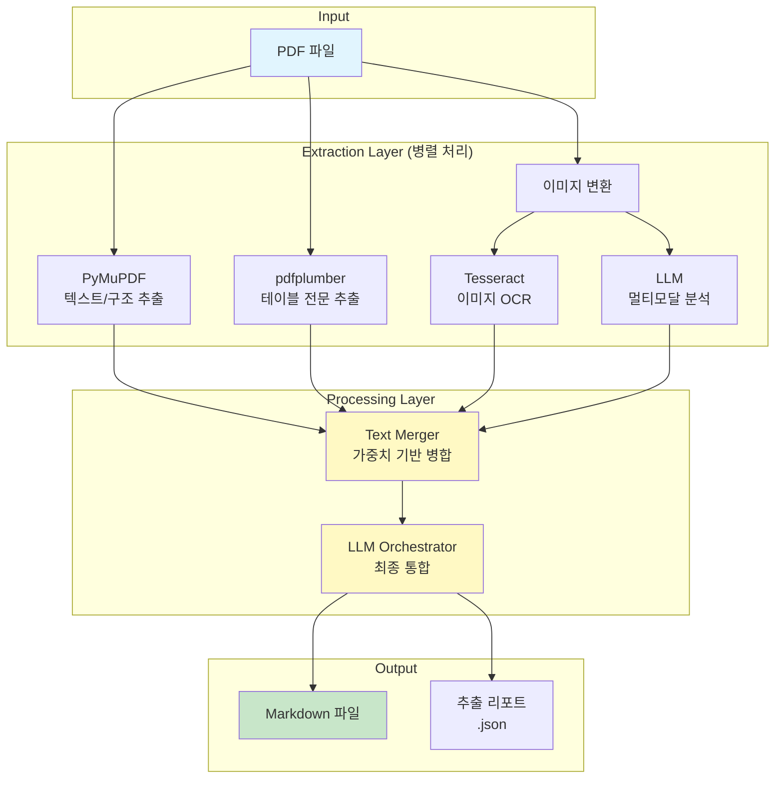
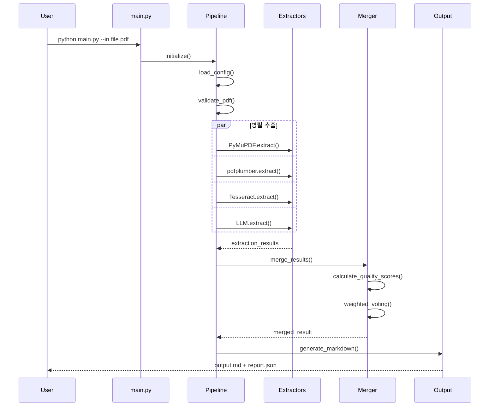

# Page-Based PDF to Markdown Pipeline

고품질 PDF → Markdown 변환을 위한 페이지 기반 추출 파이프라인

## 📋 개요

이 프로젝트는 복잡한 레이아웃의 PDF 문서를 효과적으로 Markdown으로 변환하기 위한 하이브리드 파이프라인입니다. 여러 추출 방법을 병렬로 실행하고 가중치 기반 투표 시스템을 통해 최적의 결과를 생성합니다.

### 주요 특징
- 📄 **페이지별 처리**: 각 페이지를 독립적으로 처리하여 컨텍스트 혼재 방지
- 🔄 **다중 추출기 병렬 처리**: 5가지 추출 방법 동시 실행 (PyMuPDF, pdfplumber, Tesseract, LLM PDF, LLM Image)
- 🎯 **2단계 LLM 통합**: 페이지별 통합 → 최종 문서 생성
- 🎯 **지능형 결과 병합**: 가중치 기반 투표로 최적 텍스트 선택
- 💾 **메모리 효율적 배치 처리**: 5페이지씩 처리하여 메모리 사용 최적화
- 🔒 **필수 API 키 검증**: LLM API 키가 없으면 즉시 실행 중단


## 🏗️ 아키텍처

### 전체 파이프라인 구조



### 동작 흐름



## 📁 프로젝트 구조

```
pdf2md/
│
├── main.py                 # CLI 진입점 (페이지 기반 파이프라인)
├── prompts.py              # LLM 프롬프트 모음
├── requirements.txt        # 의존성 패키지
│
├── extractors/            # 추출기 모듈
│   ├── __init__.py
│   ├── pymupdf_extractor.py      # PyMuPDF (단일 페이지 지원)
│   ├── pdfplumber_extractor.py   # pdfplumber (단일 페이지 지원)
│   ├── tesseract_extractor.py    # Tesseract OCR
│   └── llm_extractor.py          # LLM 분석 (단일 페이지 지원)
│
├── processors/            # 처리기 모듈
│   ├── __init__.py
│   ├── image_converter.py        # PDF → 이미지 변환
│   ├── text_merger.py            # 텍스트 병합 엔진
│   ├── single_page_pipeline.py   # 단일 페이지 처리
│   ├── page_orchestrator.py      # 페이지별 통합
│   └── final_orchestrator.py     # 최종 문서 생성
│
└── utils/                 # 유틸리티 모듈
    ├── __init__.py
    ├── config.py                  # 설정 관리
    ├── logger.py                  # 로깅 유틸리티
    └── validators.py              # 검증 함수
```

## 🚀 설치 및 실행

### 1. 의존성 설치

```bash
# 필수 패키지 설치
pip install -r requirements.txt

# 또는 개별 설치
pip install PyMuPDF pdfplumber
pip install pytesseract             # OCR 사용 시 (Tesseract 별도 설치 필요)
pip install anthropic openai        # LLM 사용 시

# Tesseract OCR 설치
# macOS: brew install tesseract tesseract-lang
# Ubuntu: sudo apt-get install tesseract-ocr tesseract-ocr-kor
# Windows: https://github.com/UB-Mannheim/tesseract/wiki
pip install loguru rich pydantic python-dotenv
```

### 2. 환경 설정 (필수)

**중요**: LLM API 키가 반드시 필요합니다. 키가 없으면 파이프라인이 실행되지 않습니다.

`.env` 파일 생성:

```bash
# .env (둘 중 하나는 필수)
ANTHROPIC_API_KEY=your_claude_api_key  # Claude 사용 시 필수
OPENAI_API_KEY=your_openai_api_key     # OpenAI 사용 시 필수
```

### 3. 기본 실행

```bash
# 기본 변환 (페이지별 처리)
python main.py --in document.pdf

# 출력 경로 지정
python main.py --in document.pdf --out output.md

# LLM 제공자 선택
python main.py --in document.pdf --llm claude

# 커스텀 설정 파일 사용
python main.py --in document.pdf --config custom_config.json

# 고해상도 이미지 변환 (OCR 품질 향상)
python main.py --in document.pdf --dpi 600
```

## 📌 CLI 옵션

| 옵션 | 설명 | 기본값 |
|------|------|--------|
| `--in, -i` | 입력 PDF 파일 경로 (필수) | - |
| `--out, -o` | 출력 Markdown 파일 경로 | 입력파일명.md |
| `--config, -c` | 사용자 정의 설정 파일 | - |
| `--dpi` | 이미지 변환 DPI | 300 |

**참고**: 
- 추출기 비활성화는 config.json 파일을 통해 설정 가능
- 로그는 항상 DEBUG 레벨로 출력 (상세 정보 제공)
- 추출 리포트(.report.json)는 항상 자동 생성

## ⚙️ 추출기별 특징

### 1. PyMuPDF Extractor
- **장점**: 빠른 텍스트 추출, 메타데이터 추출, 이미지 추출
- **가중치**: 0.15
- **최적 대상**: 표준 텍스트 기반 PDF

### 2. pdfplumber Extractor
- **장점**: 우수한 테이블 추출, 문자 레벨 정보
- **가중치**: 0.20
- **최적 대상**: 테이블이 많은 문서

### 3. Tesseract OCR Extractor
- **장점**: 이미지 기반 텍스트 인식, 다국어 지원
- **가중치**: 0.20
- **최적 대상**: 스캔된 문서, 이미지 PDF

### 4. LLM Extractor
- **장점**: 문맥 이해, 복잡한 레이아웃 처리
- **가중치**: PDF 0.20, 이미지 0.15
- **최적 대상**: 복잡한 레이아웃, 혼합 콘텐츠

## 🎯 처리 전략

### 페이지 기반 전략 (2025-08-17 업데이트)
- **페이지별 처리**: PDF를 개별 페이지로 분할하여 처리
  - 각 페이지에 5개 추출기 병렬 실행
  - 페이지별 LLM 통합 후 최종 문서 생성
  - 메모리 효율적인 배치 처리 (5페이지씩)
  - 파일 크기에 관계없이 모든 추출기 사용

## 📊 결과 병합 알고리즘

### 품질 점수 계산

```python
quality_score = base_weight × (0.6 × length_score + 0.4 × structure_score)
```

- **base_weight**: 추출기별 기본 가중치
- **length_score**: 추출된 텍스트 길이 (정규화)
- **structure_score**: 구조 요소 풍부도 (헤더, 테이블, 리스트 등)

### 가중치 투표 시스템

1. 각 추출기의 품질 점수 계산
2. 텍스트를 단락 단위로 분할
3. 유사한 단락들을 매칭
4. 가중치가 높은 버전 선택
5. 고유한 콘텐츠 추가

## 📈 성능 및 결과

### 주요 변경사항 (2025-08-17)
- **페이지 기반 파이프라인**: 각 페이지를 독립적으로 처리하는 향상된 방식
  - `SinglePagePipeline` - 단일 페이지 처리 파이프라인
  - `PageOrchestrator` - 페이지별 LLM 통합 (포매팅 없음)
  - `FinalOrchestrator` - 최종 문서 생성 및 마크다운 포매팅
- **pymupdf_only 모드 제거**: 모든 PDF가 full_pipeline 사용
- **필수 API 키 검증**: LLM API 키가 없으면 즉시 실행 중단
- **선택적 추출기 옵션 제거**: 모든 추출기 항상 활성화
- **LLM 타임아웃 설정**: 600초(10분)로 설정하여 안정성 향상
- **병렬 처리**: 5개 추출기 동시 실행으로 효율성 극대화
- **자동 리포트 생성**: 모든 처리에서 .report.json 파일 자동 생성
- **Legacy 코드 정리**: 테스트 디렉토리 및 불필요한 파일 제거

## 🧪 테스트

```bash
# 전체 테스트 실행
python test_pipeline.py

# 개별 PDF 테스트
python main.py --in test.pdf
```

## 📝 출력 형식

### 1. Markdown 파일 (.md)
- 구조화된 마크다운 형식
- 헤더, 단락, 리스트, 테이블 포함
- 메타데이터 섹션
- 추출 정보 푸터

### 2. 추출 리포트 (.report.json)
```json
{
  "pdf_path": "input.pdf",
  "output_path": "output.md",
  "processing_time": 15.23,
  "extraction_results": {
    "pymupdf": {"success": true, "text_length": 5234},
    "pdfplumber": {"success": true, "text_length": 5100},
    ...
  },
  "quality_scores": {...}
}
```

## 🔧 고급 설정

### 사용자 정의 설정 파일

```json
{
  "extractor_weights": {
    "pymupdf": 0.20,
    "pdfplumber": 0.25,
    "tesseract": 0.20,
    "llm_img": 0.15,
    "llm_pdf": 0.20
  },
  "llm": {
    "provider": "anthropic",
    "claude_model": "claude-3-5-sonnet-20241022",
    "openai_model": "gpt-4o",
    "max_tokens": 8192,
    "temperature": 0.1
  },
  "image_dpi": 300,
}
```

```bash
python main.py --in document.pdf --config custom_config.json
```